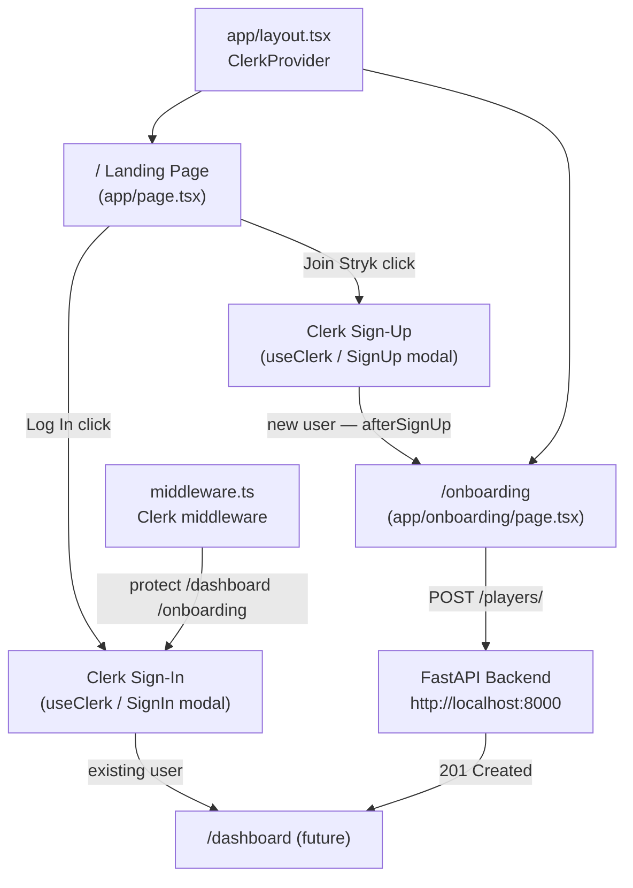
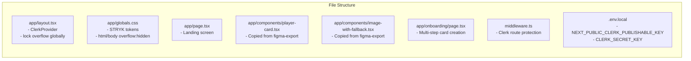
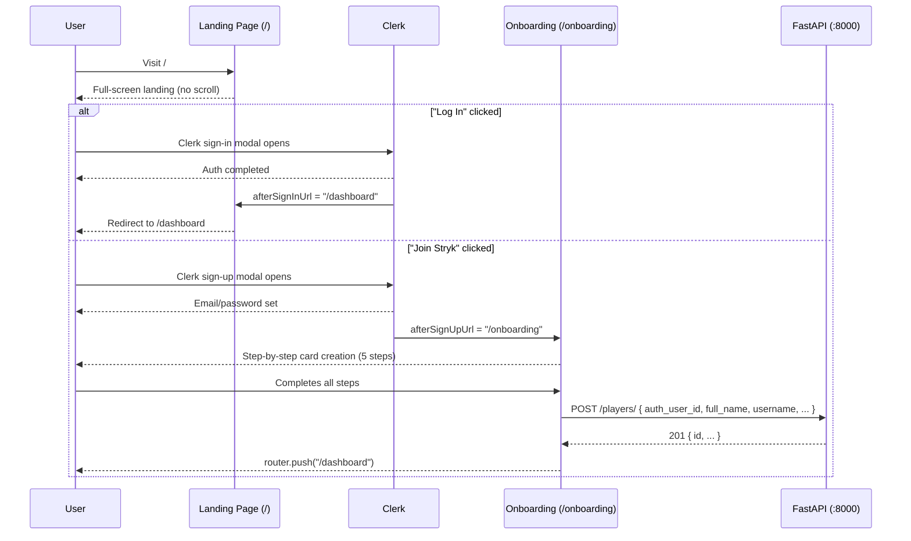
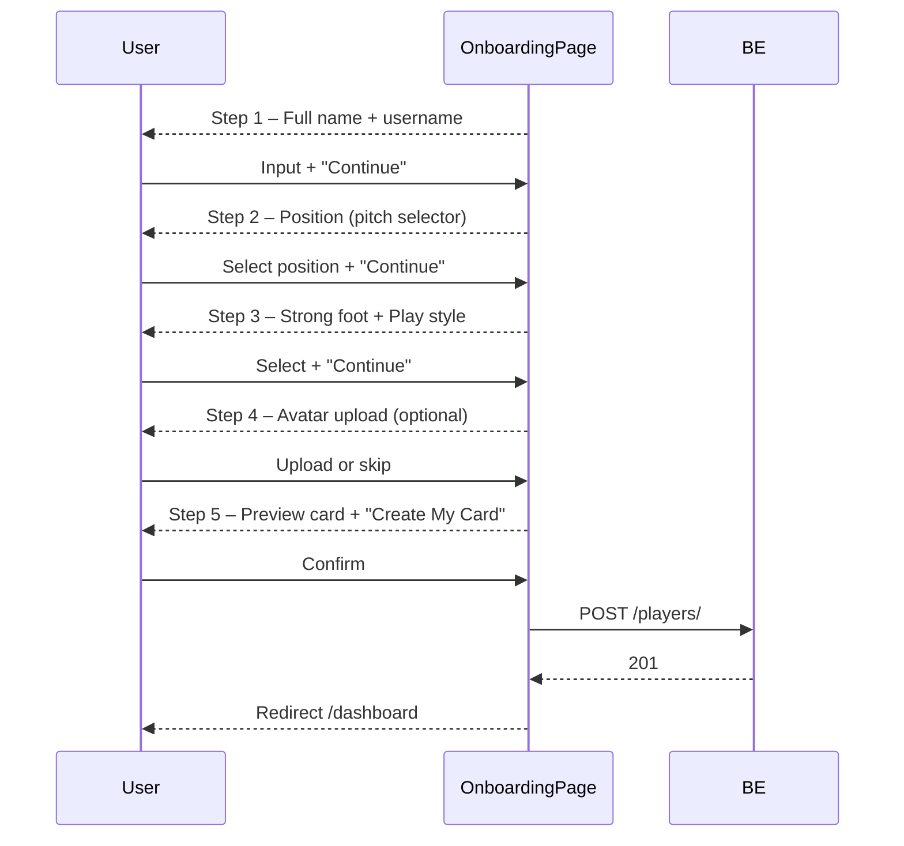

# Design Document: STRYK Landing Page Overhaul

## Overview

Redesign the `clerk-nextjs` Next.js 16 app's landing page from the default starter into a locked, full-screen mobile-app-style experience. The page presents STRYK's brand identity within a ~390px phone-frame viewport, integrates Clerk for authentication, and funnels new users through a multi-step onboarding flow that creates their player profile via the FastAPI backend.

The overhaul consists of three interconnected screens: the **landing page** (`/`), the **Clerk-hosted auth modal** (triggered by "Log In" / "Join Stryk"), and the **onboarding flow** (`/onboarding`) that collects `PlayerBase` fields and POSTs them to `http://localhost:8000/players/`.

---

## Architecture





---

## Sequence Diagrams

### Landing → Auth → Onboarding Flow



### Onboarding Step Progression



---

## Components and Interfaces

### Component: `PlayerCard`

Copied from `docs/figma-export/src/app/components/player-card.tsx` into `app/components/player-card.tsx`. The `ImageWithFallback` helper is co-located at `app/components/image-with-fallback.tsx`.

**Interface**:
```typescript
export type PlayerStats = {
  PAC: number; SHO: number; PAS: number;
  DRI: number; DEF: number; PHY: number;
};

export type Player = {
  name: string;
  username: string;
  position: string;
  ovr: number;
  style: string;
  foot: "L" | "R";
  nation: string;
  matches: number;
  stats: PlayerStats;
  avatarUrl: string;
};

type PlayerCardProps = {
  player: Player;
  size?: "sm" | "md" | "lg";
  onClick?: () => void;
};
```

**Responsibilities**:
- Renders the holographic FIFA-style player card
- Shows OVR rating, position, stats grid, avatar with mask gradient
- Accepts `size` prop (`sm` / `md` / `lg`) for responsive scaling
- On the landing page it receives `DEMO_PLAYER` — a static placeholder object

### Component: `LandingPage` (`app/page.tsx`)

A **Client Component** (`"use client"`) — needs `useClerk()` for triggering auth modals.

**Interface**:
```typescript
// No props — root page component
export default function LandingPage(): JSX.Element
```

**Responsibilities**:
- Renders the full-screen phone-frame layout (max-w-[390px], dark bg)
- Top bar: STRYK logo left, "Log In" pill right
- Hero section: label → headline → subtitle
- Animated/floating `PlayerCard` preview with `DEMO_PLAYER`
- 2×2 feature grid (static, icon + label)
- "JOIN STRYK →" full-width lime CTA
- "Log In" calls `openSignIn({ afterSignInUrl: "/dashboard" })`
- "Join Stryk" calls `openSignUp({ afterSignUpUrl: "/onboarding" })`

### Component: `OnboardingPage` (`app/onboarding/page.tsx`)

A **Client Component** — needs `useUser()`, `useRouter()`, and local `useState` for step management.

**Interface**:
```typescript
// No props — route page component
export default function OnboardingPage(): JSX.Element
```

**Responsibilities**:
- Guards against unauthenticated access (redirect to `/` if no session)
- Manages `currentStep` (1–5) with prev/next navigation
- Collects all `PlayerBase` fields across steps
- On final step, POSTs to `http://localhost:8000/players/` with `auth_user_id = user.id` from Clerk
- Shows progress bar and step indicator
- Redirects to `/dashboard` on success

### Component: `FeatureGrid`

Inline within `LandingPage` — no separate file needed.

**Items**:
```typescript
const FEATURES = [
  { icon: <CreditCard />, label: "Player Cards",   desc: "Your visual identity" },
  { icon: <Users />,      label: "Match Lobbies", desc: "Find & join games"    },
  { icon: <BarChart2 />,  label: "Real Stats",     desc: "Track performance"   },
  { icon: <TrendingUp />, label: "Grow & Earn",    desc: "Level up your card"  },
] as const;
```

---

## Data Models

### `OnboardingFormState`

```typescript
interface OnboardingFormState {
  fullName: string;        // → PlayerBase.full_name
  username: string;        // → PlayerBase.username
  position: string;        // → PlayerBase.position (default "CAM")
  secondaryPosition: string | null;  // → PlayerBase.secondary_position
  strongFoot: "Left" | "Right";      // → PlayerBase.strong_foot
  playStyle: string;       // → PlayerBase.play_style (default "Playmaker")
  avatarUrl: string | null;          // → PlayerBase.avatar_url
  bio: string;             // → PlayerBase.bio (optional, blank default)
}
```

**Validation Rules**:
- `fullName`: required, 2–100 chars
- `username`: required, 3–40 chars, alphanumeric + dots/underscores, no spaces
- `position`: one of the 14 position codes (GK, LB, CB, RB, CDM, CM, LM, RM, CAM, LW, RW, ST, CF, LAM)
- `strongFoot`: exactly "Left" or "Right"
- `playStyle`: one of ["Playmaker", "Dribbler", "Target Man", "Box-to-Box", "Sweeper", "Shot-stopper"]

### `PlayerCreatePayload` (API request body)

```typescript
interface PlayerCreatePayload {
  auth_user_id: string;   // Clerk user.id
  full_name: string;
  username: string;
  avatar_url: string | null;
  position: string;
  secondary_position: string | null;
  strong_foot: string;
  play_style: string;
  bio: string | null;
  rating: number;         // hardcoded 80 for new players
}
```

### Demo Player (landing page only)

```typescript
const DEMO_PLAYER: Player = {
  name: "Your Name",
  username: "your.tag",
  position: "CAM",
  ovr: 87,
  style: "Playmaker",
  foot: "L",
  nation: "—",
  matches: 0,
  stats: { PAC: 84, SHO: 82, PAS: 91, DRI: 89, DEF: 54, PHY: 71 },
  avatarUrl: "",  // ImageWithFallback shows placeholder SVG
};
```

---

## Key Functions with Formal Specifications

### `LandingPage` — auth trigger handlers

```typescript
function handleLogIn(): void
```

**Preconditions:**
- `openSignIn` from `useClerk()` is available (Clerk SDK loaded)
- User is not already signed in

**Postconditions:**
- Clerk sign-in modal opens
- `afterSignInUrl` is set to `"/dashboard"`
- No state mutation in the component

```typescript
function handleJoinStryk(): void
```

**Preconditions:**
- `openSignUp` from `useClerk()` is available

**Postconditions:**
- Clerk sign-up modal opens
- `afterSignUpUrl` is set to `"/onboarding"`

### `OnboardingPage` — step navigation

```typescript
function goNext(): void
```

**Preconditions:**
- `currentStep < TOTAL_STEPS` (5)
- Current step's required fields are valid (validated inline)

**Postconditions:**
- `currentStep` incremented by 1
- No API calls made

```typescript
function goPrev(): void
```

**Preconditions:**
- `currentStep > 1`

**Postconditions:**
- `currentStep` decremented by 1
- Form state preserved

### `OnboardingPage` — submit

```typescript
async function handleSubmit(): Promise<void>
```

**Preconditions:**
- `currentStep === TOTAL_STEPS`
- `user` from `useUser()` is non-null
- `formState.fullName` and `formState.username` are non-empty
- `formState.position` is a valid position code

**Postconditions:**
- POSTs `PlayerCreatePayload` to `http://localhost:8000/players/`
- On 201 response: calls `router.push("/dashboard")`
- On error: sets `submitError` state with message, stays on step 5
- No duplicate submissions (button disabled while `isSubmitting`)

**Loop Invariants:** N/A (single fetch call, no loops)

---

## Algorithmic Pseudocode

### Landing Page Layout Algorithm

```pascal
PROCEDURE renderLandingPage()
  OUTPUT: full-screen JSX, viewport-locked, max-width 390px

  BEGIN
    // Outer shell: fills 100dvh, dark bg, centers phone frame
    RENDER shell WITH
      height = 100dvh
      overflow = hidden
      background = #0A0A0A
      display = flex, alignItems = center, justifyContent = center

    // Phone frame: max-w-[390px], fills height
    RENDER phoneFrame WITH
      width = 100%, maxWidth = 390px
      height = 100%
      overflow = hidden, position = relative
      background = #05070B

    // Sections stacked top-to-bottom, no scroll
    RENDER topBar         // logo + Log In pill
    RENDER heroSection    // label + headline + subtitle
    RENDER cardPreview    // PlayerCard with float animation
    RENDER featureGrid    // 2x2 grid
    RENDER ctaButton      // "JOIN STRYK →"
  END
END
```

### Onboarding Step Machine

```pascal
ALGORITHM onboardingStepMachine(event)
  INPUT: event ∈ { NEXT, PREV, SUBMIT }
  STATE: currentStep ∈ [1..5], formState: OnboardingFormState

  BEGIN
    MATCH event WITH
    | NEXT →
        IF validateStep(currentStep, formState) THEN
          currentStep ← currentStep + 1
        ELSE
          SET fieldErrors for failed validations
        END IF

    | PREV →
        IF currentStep > 1 THEN
          currentStep ← currentStep - 1
        END IF

    | SUBMIT →
        ASSERT currentStep = 5
        ASSERT isAuthenticated(user)

        payload ← buildPayload(user.id, formState)
        response ← await POST("/players/", payload)

        IF response.status = 201 THEN
          router.push("/dashboard")
        ELSE
          SET submitError ← response.errorMessage
        END IF
    END MATCH
  END
```

### Viewport Lock Strategy

```pascal
PROCEDURE lockViewport()
  // Applied globally in globals.css
  SET html.overflow = hidden
  SET html.height = 100%
  SET body.overflow = hidden
  SET body.height = 100%
  SET body.position = fixed  // prevents iOS Safari bounce

  // Applied per-page via Tailwind on root div
  SET root.height = 100dvh
  SET root.overflow = hidden
END
```

---

## Example Usage

### Landing Page — Clerk auth trigger

```typescript
"use client";

import { useClerk } from "@clerk/nextjs";

export default function LandingPage() {
  const { openSignIn, openSignUp } = useClerk();

  return (
    <div className="h-[100dvh] overflow-hidden bg-[#0A0A0A] flex items-center justify-center">
      <div className="relative w-full max-w-[390px] h-full overflow-hidden bg-[#05070B]">
        {/* Top bar */}
        <div className="flex items-center justify-between px-5 pt-5">
          <StryKLogo />
          <button
            onClick={() => openSignIn({ afterSignInUrl: "/dashboard" })}
            className="px-4 py-1.5 rounded-full border border-white/20 text-sm tracking-widest"
          >
            Log In
          </button>
        </div>

        {/* ... hero, card, grid ... */}

        {/* CTA */}
        <button
          onClick={() => openSignUp({ afterSignUpUrl: "/onboarding" })}
          className="w-full rounded-full bg-[#C6FF00] text-black font-display py-4 tracking-widest"
        >
          JOIN STRYK →
        </button>
      </div>
    </div>
  );
}
```

### Onboarding — POST to backend

```typescript
async function handleSubmit() {
  if (!user) return;
  setIsSubmitting(true);
  try {
    const res = await fetch("http://localhost:8000/players/", {
      method: "POST",
      headers: { "Content-Type": "application/json" },
      body: JSON.stringify({
        auth_user_id: user.id,
        full_name: formState.fullName,
        username: formState.username,
        avatar_url: formState.avatarUrl,
        position: formState.position,
        secondary_position: formState.secondaryPosition,
        strong_foot: formState.strongFoot,
        play_style: formState.playStyle,
        bio: formState.bio || null,
        rating: 80,
      }),
    });
    if (!res.ok) throw new Error(await res.text());
    router.push("/dashboard");
  } catch (err) {
    setSubmitError(err instanceof Error ? err.message : "Unknown error");
  } finally {
    setIsSubmitting(false);
  }
}
```

### Clerk Middleware (`middleware.ts`)

```typescript
import { clerkMiddleware, createRouteMatcher } from "@clerk/nextjs/server";

const isProtected = createRouteMatcher(["/dashboard(.*)", "/onboarding(.*)"]);

export default clerkMiddleware((auth, req) => {
  if (isProtected(req)) auth.protect();
});

export const config = {
  matcher: ["/((?!_next|[^?]*\\.(?:html?|css|js(?!on)|jpe?g|webp|png|gif|svg|ttf|woff2?|ico|csv|docx?|xlsx?|zip|webmanifest)).*)","/(api|trpc)(.*)"],
};
```

### `globals.css` — Overflow lock + STRYK tokens

```css
@import "tailwindcss";

:root {
  --stryk-lime: #C6FF00;
  --stryk-bg: #05070B;
  --stryk-surface: #0B1020;
  --stryk-border: rgba(255, 255, 255, 0.08);
  --background: #0A0A0A;
  --foreground: #ededed;
}

@theme inline {
  --color-background: var(--background);
  --color-foreground: var(--foreground);
  --font-sans: var(--font-geist-sans);
  --font-mono: var(--font-geist-mono);
}

/* Viewport lock — prevents any scroll on any screen */
html, body {
  height: 100%;
  overflow: hidden;
  position: fixed;
  width: 100%;
}
```

### `app/layout.tsx` — ClerkProvider

```typescript
import { ClerkProvider } from "@clerk/nextjs";

export default function RootLayout({ children }: { children: React.ReactNode }) {
  return (
    <ClerkProvider>
      <html lang="en" className={`${geistSans.variable} ${geistMono.variable} antialiased`}>
        <body>{children}</body>
      </html>
    </ClerkProvider>
  );
}
```

---

## Correctness Properties

*A property is a characteristic or behavior that should hold true across all valid executions of a system — essentially, a formal statement about what the system should do. Properties serve as the bridge between human-readable specifications and machine-verifiable correctness guarantees.*

### Property 1: Viewport Lock

For any render of `/` or `/onboarding`, the root element's computed `overflow` is `hidden` and its height equals `100dvh`, ensuring `document.body.scrollHeight === window.innerHeight` and no scrollable overflow exists regardless of content height.

**Validates: Requirements 1.1, 1.2, 1.3**

### Property 2: Onboarding Auth Guard

For any unauthenticated HTTP request whose path matches `/onboarding` or `/onboarding/*`, the `Middleware` intercepts the request and redirects to Clerk sign-in before the `Onboarding_Page` component renders.

**Validates: Requirements 5.4, 5.5, 11.2, 11.3**

### Property 3: Submit Idempotency

For any invocation of `handleSubmit` while `isSubmitting === true`, the function returns immediately without initiating a second `fetch` call — the guard condition prevents duplicate `POST /players/` requests.

**Validates: Requirements 10.6**

### Property 4: Single Redirect on Success

For any successful `POST /players/` response where `res.status === 201`, `router.push("/dashboard")` is called exactly once and `isSubmitting` is reset to `false` in the `finally` block.

**Validates: Requirements 10.4, 10.7**

### Property 5: Removed UI Elements

For all render states of `app/page.tsx`, neither the text "Explore Demo" nor any social-proof element (avatar circles or player-count labels such as "10K+ players") appears in the rendered DOM.

**Validates: Requirements 3.3, 3.4, 3.5**

### Property 6: PlayerCard Field Completeness

For any valid `Player` object, the `PlayerCard` component renders the player's OVR rating, position, name, username, play style, strong foot, nation, and all six stats (PAC, SHO, PAS, DRI, DEF, PHY) in the output DOM.

**Validates: Requirements 6.2**

### Property 7: Demo Card Resilience

For any `PlayerCard` render where `avatarUrl` is an empty string or absent, `ImageWithFallback` displays the placeholder SVG rather than a broken `` element.

**Validates: Requirements 6.4, 13.4**

### Property 8: Step Navigation — Forward

For any `currentStep` in `[1, 4]` and any form state that passes `validateStep(currentStep, formState)`, calling `goNext` increments `currentStep` by exactly 1.

**Validates: Requirements 8.2**

### Property 9: Step Navigation — Backward

For any `currentStep` in `[2, 5]`, calling `goPrev` decrements `currentStep` by exactly 1.

**Validates: Requirements 8.3**

### Property 10: Invalid Step Blocks Progression

For any `currentStep` in `[1, 5]` and any form state that fails `validateStep(currentStep, formState)`, calling `goNext` does not change `currentStep` and sets at least one field-level error.

**Validates: Requirements 8.4**

### Property 11: Back-Navigation Preserves Form State

For any `OnboardingFormState` and any `currentStep > 1`, calling `goPrev` then inspecting the form state yields a value equal to the original form state — no field is cleared or mutated by backward navigation.

**Validates: Requirements 8.5**

### Property 12: Progress Indicator Accuracy

For any `currentStep` in `[1, 5]`, the progress indicator rendered by `Onboarding_Page` reflects that exact step number out of five.

**Validates: Requirements 8.6**

### Property 13: Username Validation — Reject Invalid Inputs

For any string that violates the username rules (length outside `[3, 40]`, contains spaces, contains characters other than alphanumerics/dots/underscores, or starts/ends with a dot), the `OnboardingForm` validator returns an error for the `username` field.

**Validates: Requirements 9.2**

### Property 14: Payload Construction Invariants

For any valid `OnboardingFormState` and any Clerk `user.id` string, `buildPayload(user.id, formState)` produces a `PlayerCreatePayload` where `auth_user_id === user.id` and `rating === 80`.

**Validates: Requirements 10.2, 10.3**

### Property 15: Error Response Prevents Redirect

For any non-2xx HTTP status code or any network error returned by `POST /players/`, the `Onboarding_Page` sets `submitError` to a non-empty string and does not call `router.push`.

**Validates: Requirements 10.5**

### Property 16: Middleware Route Matcher Completeness

For any URL path string matching the pattern `/dashboard` or `/dashboard/*` or `/onboarding` or `/onboarding/*`, the `isProtected` matcher returns `true`.

**Validates: Requirements 11.2**

---

## Error Handling

### Auth SDK not loaded

**Condition**: `useClerk()` returns `undefined` (Clerk JS bundle not yet hydrated)  
**Response**: Buttons render normally but `openSignIn`/`openSignUp` calls are no-ops during SSR since the component is `"use client"`  
**Recovery**: Hydration completes before user interaction in practice; no explicit fallback needed

### `POST /players/` failure

**Condition**: Backend returns non-2xx or network error  
**Response**: `submitError` state is set; displayed inline on step 5 as a red error banner  
**Recovery**: User can retry; `isSubmitting` is reset to `false` in `finally`

### Onboarding accessed without auth

**Condition**: Unauthenticated user visits `/onboarding` directly  
**Response**: `clerkMiddleware` intercepts and redirects to Clerk sign-in  
**Recovery**: After sign-in, Clerk redirects back to `/onboarding`

### Avatar upload failure (future — step 4)

**Condition**: Image upload to storage fails  
**Response**: Avatar upload is optional — user can skip; `avatarUrl` defaults to `null`  
**Recovery**: Player is created without avatar; can be updated later

---

## Testing Strategy

### Unit Testing Approach

Key pure functions to unit test:
- `validateStep(step, formState)` → boolean — covers all 5 steps, empty fields, invalid patterns
- `buildPayload(userId, formState)` → `PlayerCreatePayload` — checks field mapping and defaults
- Username regex validation — alphanumeric, dots, underscores; no spaces, no leading/trailing dots

### Property-Based Testing Approach

**Property Test Library**: `fast-check` (already popular in JS/TS ecosystem)

Properties to verify:
- For any `formState` with valid fields, `buildPayload` always includes `auth_user_id` and `rating: 80`
- For any `currentStep ∈ [1..4]`, `goNext()` increments step by exactly 1
- For any `currentStep ∈ [2..5]`, `goPrev()` decrements step by exactly 1
- `handleSubmit` called with `isSubmitting === true` never triggers a fetch

### Integration Testing Approach

- Render `LandingPage` in jsdom; assert no `overflow-y: scroll` on root elements
- Assert "Explore Demo" text is absent from DOM
- Assert social proof row is absent from DOM
- Mock `useClerk()` and verify `openSignIn` is called with `{ afterSignInUrl: "/dashboard" }` on "Log In" click
- Mock `fetch` and verify correct `POST /players/` body structure on step 5 submit

---

## Performance Considerations

- `PlayerCard` on the landing page is a static render (no data fetching) — no Suspense needed
- Clerk JS bundle is loaded asynchronously by `ClerkProvider` — does not block LCP
- The floating card animation uses CSS `@keyframes` (transform only) — GPU-composited, no layout thrash
- `"use client"` boundary is limited to page-level components; no client components in `layout.tsx`

---

## Security Considerations

- `auth_user_id` sent to backend is `user.id` from Clerk's `useUser()` hook — trusted client-side value; the backend should verify via Clerk JWT in production (out of scope for this overhaul)
- `NEXT_PUBLIC_CLERK_PUBLISHABLE_KEY` is safe to expose; `CLERK_SECRET_KEY` must stay server-side only (never in client components)
- Onboarding form fields are trimmed and length-validated before submission to prevent oversized payloads
- No `dangerouslySetInnerHTML` anywhere in the new components

---

## Dependencies

| Package | Purpose | Installation |
|---------|---------|-------------|
| `@clerk/nextjs` | Auth SDK — `ClerkProvider`, `useClerk`, `useUser`, `clerkMiddleware` | `npm install @clerk/nextjs` |
| `lucide-react` | Icon set for feature grid and onboarding buttons | `npm install lucide-react` |

**Existing dependencies used (no install needed)**:
- `next` 16.2.7 — App Router, `useRouter` from `next/navigation`
- `react` 19.2.4 — `useState`, `useEffect`
- `tailwindcss` ^4 — all styling via `@import "tailwindcss"` (no config file)
- `next/font/google` — Geist Sans already in `layout.tsx`

**Environment variables (`.env.local`)**:
```bash
NEXT_PUBLIC_CLERK_PUBLISHABLE_KEY=pk_test_...
CLERK_SECRET_KEY=sk_test_...
NEXT_PUBLIC_CLERK_SIGN_IN_URL=/sign-in
NEXT_PUBLIC_CLERK_SIGN_UP_URL=/sign-up
NEXT_PUBLIC_CLERK_AFTER_SIGN_IN_URL=/dashboard
NEXT_PUBLIC_CLERK_AFTER_SIGN_UP_URL=/onboarding
```
